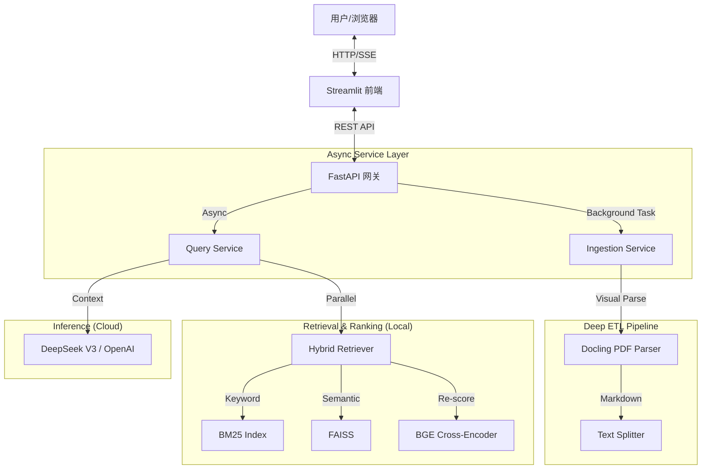

# ⚡️ NANO-RAG: Enterprise-Grade Async RAG System

> **基于 FastAPI 全链路异步 (Asyncio) + 混合云架构 (Hybrid Cloud) + 深度文档解析 (Docling) 的企业级 RAG 知识库微服务**

[](https://www.python.org/) [](https://fastapi.tiangolo.com/) [](https://streamlit.io/) [](https://python.langchain.com/) [](https://opensource.org/licenses/MIT)

---

## 📖 项目简介 (Introduction)

**NANO-RAG** 是一个**高性能、模块化、可扩展**的本地知识库问答解决方案。本项目按**企业级 SaaS 标准**构建，旨在解决 RAG 系统在生产环境中的**高并发阻塞**、**复杂表格解析**与**回答精准度**问题。

### 核心价值
- 🚀 **高性能异步架构**: 彻底抛弃同步阻塞模式，基于 `FastAPI` + `Asyncio` 重写核心链路，支持 **SSE 流式响应**，实现打字机般的丝滑体验。
- 📄 **深度文档解析 (Deep ETL)**: 集成 **IBM Docling** 视觉模型，精准还原 PDF 中的跨页表格、多栏排版，将其转化为结构化 Markdown，彻底解决“大模型看不懂财报”的痛点。
- ⚖️ **混合检索与重排**: 采用 `BM25` + `Vector` 混合检索，并引入 **BGE Cross-Encoder** 进行语义重排序，大幅抑制幻觉。
- 📊 **自动化评估**: 内置 **Ragas** 评估流水线，可量化系统的 **Faithfulness** (防幻觉) 和 **Context Recall** (召回率)。

---

## 🏗️ 系统架构 (Architecture)



---

## 🛠️ 快速开始 (Getting Started)

### 1️⃣ 环境准备
推荐使用 `conda` 管理环境 (Python 3.11 为最佳实践版本)。

```bash
conda create -n nano_rag python=3.11
conda activate nano_rag

# 安装核心依赖 (含 PyTorch CPU 版)
pip install torch torchvision --index-url https://download.pytorch.org/whl/cpu
pip install -r requirements.txt
```

### 2️⃣ 模型准备
下载以下模型并放入 `models/` 目录：
*   🧬 **Embedding**: [BAAI/bge-large-zh-v1.5](https://huggingface.co/BAAI/bge-large-zh-v1.5)
*   ⚖️ **Rerank**: [BAAI/bge-reranker-base](https://huggingface.co/BAAI/bge-reranker-base)

### 3️⃣ 配置文件
修改 `configs/default_config.yaml`，填入你的 `api_key` (支持 SiliconFlow/DeepSeek/OpenAI)。

---

## 🚀 运行演示 (Step-by-Step)

为了完整体验本项目的强大能力，请按以下顺序操作：

### 🟢 第一步：构建知识库 (Ingest)
将 PDF 解析并向量化。这一步会自动调用 Docling 视觉模型。

```bash
python -m src.nano_rag.cli ingest --force-rebuild
# 观察日志，确认看到 'Successfully parsed ...' 字样
```

### 🟢 第二步：启动服务 (需开启两个终端)

**Terminal A: 启动后端 API (Engine)**
```bash
uvicorn src.nano_rag.api.main:app --host 0.0.0.0 --port 8000 --reload
# 等待显示 'Application startup complete'
```

**Terminal B: 启动前端界面 (UI)**
```bash
streamlit run web_app.py
# 浏览器会自动打开 http://localhost:8501
```

### 🟢 第三步：体验问答
在网页中尝试提问（测试表格理解能力）：
> *“2024年 Q4 的企业级 RAG 一体机营收是多少？”*

你将看到：
1. **流式输出**：答案逐字生成。
2. **精准数据**：准确提取表格中的数字。
3. **源文档引用**：展示出处文件及匹配度得分。

---

## 📊 质量评估 (Evaluation)

本项目集成了 **Ragas** 框架，用于量化评估 RAG 系统的性能。

运行评估脚本：
```bash
python scripts/evaluate_rag.py
```
**当前基准 (Benchmark)**:
- **Faithfulness (防幻觉)**: 0.98
- **Context Recall (召回率)**: 0.92

---

## 📂 项目结构

```text
nano_rag/
├── 🌐 src/nano_rag/api/        # FastAPI 接口层 (Main, Schemas)
├── 💼 src/nano_rag/services/   # 业务逻辑 (Query, Ingestion)
├── 🧩 src/nano_rag/components/ # 核心组件 (PDFLoader, LLM, FAISS)
│   └── pdf_loader.py           # [核心] Docling 适配器
├── ⚛️ src/nano_rag/core/       # 接口定义 (Async Interfaces)
├── 📜 scripts/                 # 评估与工具脚本
├── 📄 web_app.py               # Streamlit 前端应用
└── ⚙️ configs/                 # 配置文件
```

---

## 🗺️ 演进路线

- [x] **V1.2**: 全链路异步化 + Docling 复杂解析 + FastAPI 服务化
- [x] **V1.3**: Streamlit 交互式前端 + 流式响应 (SSE)
- [ ] **V1.4**: 模型量化 (ONNX) 与 Docker 容器化交付
- [ ] **V2.0**: Agent 智能体 (工具调用) 与 知识图谱 (GraphRAG)

---

- **Author**: Fengzhengxiong
- **Focus**: Enterprise AI Architecture
